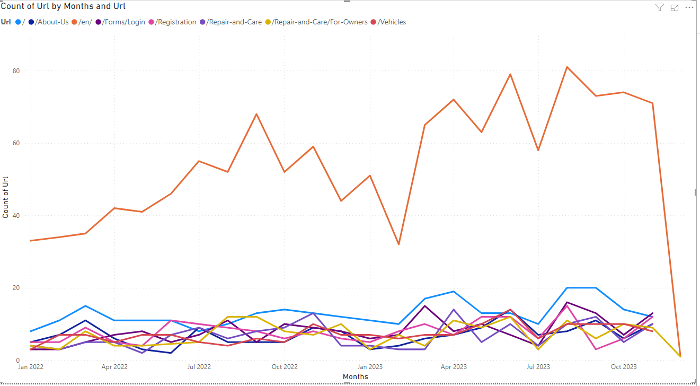

<div align="center">

# xDB Analytics Extractor

A tool for integrating your Sitecore Analytics with your BI platform

[About this Project](#about-this-project) •
[Prerequisites](#prerequisites) •
[Installation](#installation) •
[Configuration](#configuration) •
[PowerBI](#powerbi) •
[Extending the Service](#extending-the-service)

</div>

## About this Project

**xDB Analytics Extractor** is a project that allows you to access and use data from xConnect, the service that communicates with the xDB, where Sitecore stores all of your visitors' data and interactions. With xDB Analytics Extractor, you can retrieve data from xConnect, modify it to meet your requirements, and save it in a format that BI tools can understand. This allows you to create custom charts and reports using data not available in the Sitecore Analytics dashboard.

|Sitecore Analytics Dashboard|PowerBI|
|--|--|
|||

## Prerequisites

#### SDKs
- [.NET 7.x](https://dotnet.microsoft.com/en-us/download/dotnet/7.0)

#### Apps
- MSSQL Server 2019 or later (**required only if you want to store the data in a database**).

#### Certificates
- You need a valid Sitecore certificate. To get your certificate follow [this guide](https://doc.sitecore.com/xp/en/developers/hd/19/sitecore-headless-development/walkthrough--configuring-sitecore-ca-certificates-for-node-js.html).

#### Connection URLs
- All of the connection urls you are going to need are outlined in the *xDB Analytics Extractor Configuration* below. All connection URLs follow the pattern `<instance-name_xconnect>/<subdirectory>`

<hr/>

## Installation

### `appsettings` Configuration

Before running the installation script, make sure that you have made the required changes in the `appsettings` configurations for the service's projects.

<details>
    <summary> <h4>xDB Analytics Extractor Configuration</h4> </summary>

> To configure the xDB Analytics Extractor, change the following values:
> |Value|Description|Example|
> |----|----|----|
> |Certificate|Your xConnect Certificate|`StoreName=My;StoreLocation=LocalMachine;FindType=FindByThumbprint;FindValue=804F256208CCFEA7F17570583EC9BBDA32ECE32EDCE`|
> |ClientUrl|Your xConnect url|`https://sc103xp0_xconnect`|
> |CollectionClientUrl|Your xConnect `odata` URL|`https://sc103xp0_xconnect/odata`|
> |SearchClientUrl|Your xConnect `odata` URL|`https://sc103xp0_xconnect/odata`|
> |ConfigurationClientUrl|Your xConnect `configuration` URL|`https://sc103xp0_xconnect/configuration`|
> |InternalDBPath|The path and filename of the internal db for the tool|`c:\\xDBAnalyticsExtractor\\xDBAnalyticsExtractor.db`|
> |CSVExportPath|The path you want the files to be exported|`c:\\xDBAnalyticsExtractor`|
> |HistoricalDaysExport|The number of days in the past the worker will fetch data from|1|
> |SqlServer.ConnectionString|The connection string for the database|`Server=LT-JDOE\\SQL2019;Database=xDB Analytics Extractor;User Id=jdoe;Password=12345;Trusted_Connection=True;`|

> [!NOTE]
> The SQLite that is defined by `InternalDBPath` is used by the tool to keep track of exported data.

> [!NOTE]
> You only need to change the `HistoricalDaysExport` only if you want to run the service in historical mode.

> [!NOTE]
> You need to change the `SqlServer.ConnectionString` only if you want to export the data into a database.

> [!NOTE]
> You need to change the `CSVExportPath` only if you want to export the data into a file. If you don't have any existing folder that you want to use, you can use the `CSV Action` to create a new directory path with all the required priviledges.
</details>

<details>
    <summary> <h4>InteractionsEvaluator Configuration</h4> </summary>

> To configure the InteractionEvaluator, change the following values:
> |Value|Description|Example|
> |----|----|----|
> |Certificate|Your xConnect Certificate|`StoreName=My;StoreLocation=LocalMachine;FindType=FindByThumbprint;FindValue=804F256208CCFEA7F17570583EC9BBDA32ECE32EDCE`|
> |ClientUrl|Your xConnect url|`https://sc103xp0_xconnect`|
> |CollectionClientUrl|Your xConnect `odata` URL|`https://sc103xp0_xconnect/odata`|
> |SearchClientUrl|Your xConnect `odata` URL|`https://sc103xp0_xconnect/odata`|
> |ConfigurationClientUrl|Your xConnect `configuration` URL|`https://sc103xp0_xconnect/configuration`|
</details>

<details>
    <summary> <h4>DatabaseBuilder Configuration</h4> </summary>

> To configure the DatabaseBuilder, change the following values:
> |Value|Description|Example|
> |----|----|----|
> |SqlServer.ConnectionString|The connection string for the database|`Server=LT-JDOE\\SQL2019;Database=xDB Analytics Extractor;User 

> [!IMPORTANT]
> You need to update the database name in the Script0001_CreateTables.sql too.
</details>

### Running the Installation

The installation of the service requires minimal interaction with the user. All you need to do is to run the
`install.ps1` file and the installer will do the rest.

```powershell
PS > install.ps1
```

The script will read the `install.json` configuration file and run the defined steps. The default configuration creates a minimal setup. If you want to tailor your installation refer to the [Configuration](#configuration) section.

### Calculate the Workload
To calculate the workload that your instance can handle and to determine how often the scheduler should trigger, you can use the `InteractionsEvaluator` project. This project will perform a benchmarking run on your Sitecore instance to statistically determine 
* How many interactions can be exported your instance with the XConnect per minute
* How many interactions are added to your instance per day

More info on how to use the `InteractionsEvaluator` tool and the results it produces, can be found [here](docs/InteractionsEvaluator-Tool.md).

### Register the Service

#### 1. Open the Task Scheduler
Click on **Start** and type *Task Scheduler* to open it. You can also select it from the Start Menu under *Window Administrative Tools* (or *Windows Tools* when using Windows 11).

#### 2. Create a new  folder and a new Basic Task
Click the **New Folder...** in the action bar on the right side and create a new folder. Then click on **Create Basic Tasks...** in the action bar nad give your task a name.

<details>
    <summary> See image </summary>


</details>

> [!TIP]
> It is not necessary to create a new folder, but it is better to organize your tasks in folders for better maintenance.

#### 3. Schedule the task
The trigger determines when the task should be executed. Choose the **Daily** trigger, and click **Next** to configure when exactly the tasks need to be executed.

#### 4. Set the action
Here comes the important part, for the action, we are going to **Start a Program**

<details>
    <summary> See image </summary>


</details>

#### 5. Start a Program - Executable
The executable that we want to run is the `xDBAnalyticsExtractor.exe`. You can find this executable file in the publish folder, generated during the installation process. Just enter the path in the Program/script field (see screenshot in step 6).

<details>
    <summary> See image </summary>


</details>

#### 6. Add Arguments
In the arguments field, we are going to add the runtime arguments we want to use. The service supports four arguments out of the box:
- **Current Data (`-current`)**: These are the data generated in near-real time on your instance. This option **is mutually exclusive** with the `-historical` argument.
- **Historical Data (`-historical`)**: These are the data generated from the beginning of time **UP TO** the **first run** of the service. This option **is mutually exclusive** with the `-current` argument
- **CSV Exporting (`-file`)**: This option exports the generated data in CSV format.
- **SQL Export (`-sql`)**: This option exports the generated data in an SQL Server database.

> [!CAUTION]
> Do not use both `-current` and `-historical` arguments for the same scheduler, because the scheduler will never run. If you want both `-current` and `-historical` data, create two schedulers.

<details>
    <summary> See image </summary>


</details>

> [!TIP]
> You can use both `-file` and `-sql` options if you want to export to different formats

> [!TIP]
> You can create your own exporters. For more info refer to the [Add a new exporter](#adding-a-new-exporter) section.

#### 7. Finish
Click on **Next** and review your settings on the finish screen. Make sure that you select **Open the properties dialog...** so we can configure some more settings.

<details>
    <summary> See image </summary>


</details>

#### 8. Advanced Settings
There are two settings that we need to change for our scheduled xDB Analytics Extractor task. We will need to make sure that the service runs even when we are not logged on, which you can do on the General tab.

<details>
    <summary> See image </summary>


</details>

Also we need to configure when the task will repeat during the day. To do that, click the Triggers tab and select the time, you have calculated [**using the interactions evaluator** tool](#calculate-the-workload)

<details>
    <summary> See image </summary>


</details>

#### 9. Save the Task
Click **Ok** and enter your password, so the task can run when you are not logged on. 

<hr/>

## Configuration

The `yourconfig.json` file outlines the steps that the installer will run. You can add any of the available steps in your
configuration file, only the provided steps will run.

> [!CAUTION]
> While it might be tempting to skip certain steps in the process for the sake of efficiency, doing
> so could lead to unexpected outcomes. For instance, if you choose to test your modifications or
> deploy your personalized version of the service without first building the project, you may
> encounter issues. Therefore, it’s generally advised to complete the `clean`, `restore`, `build` and `publish`
> steps in their entirety. Only consider bypassing these steps if you have a thorough understanding
> of the potential implications and are completely confident in your decision to do so.

There are several configuration options for the script, outlined in the [Configuration Guide](docs/Configuration-Guide.md)

<hr/>

## PowerBI

### Connect PowerBI With xDB Analytics Extractor

> [!NOTE]
> You can download and install the **PowerBI** app from **Microsoft Store**.

#### Gather Export Data Using A Database

1. Open PowerBI
2. From the **Home** tab, select Get data> SQL Server
3. In the following pop up, set the below values as follow:

| Key      | Value                          |
| -------- | ------------------------------ |
| Server:  | < your-computer-name >\SQL2019 |
| Database | xDB Analytics Extractor                    |
| Import?  | True                           |

4. Click ok.
5. Select all the tables to import
6. Click **Load**.

#### Gather Data Using SCV files

1. Open PowerBI
2. From the **Home** tab, select **Get data** > **Text CSV**
3. Select the **Files to Import**
4. Click on **Load**

#### Troubleshoot Issues

##### Error: The specified culture is not supported.

If you import from **Database** and you get this error:

1. Go to file click on Options and Settings > Options.
2. Under the **Data Cache Management Options** click on **Clear Cache** and **Restore Defaults** and click **OK**.
3. Save the file and click apply changes.
4. Data from the DB will load automatically.

If you import from **CSV** files and you get this error:

1. Select the files you want to import
2. Right click with your mouse
3. Click on properties
4. Change the files to open with “Notepad“
5. Save

## Example How To Create A Power BI Chart

In this example we create an "Online interactions by visits and value per visit" "line and stacked column" chart, using xDB Analytics Extractor.

##### For the **y-axis**

1. Create a **new column** on the Interactions Table
   `Months = FORMAT(Interactions[EndDateTime],"yyyy-MMMM")`.
2. Then select this column created and go to tab **Column tools** > set the
   **DataType** = **Date/Time**.

---

##### For the **x-axis**

1. Select the:`SUM(EngagementValue)` column from Interactions table, and change the metric display to **Average**.

---

##### For **Filters**

1. Select the **ChannelId** and tick all the checkboxes

## Samples

<details>
    <summary> channel-groups-by-visits </summary>

 [channel-groups-by-visits](docs/pbix_scripts/channel-groups-by-visits/channel-groups-by-visits.pbix)

 
</details>

<details>
    <summary> device-types </summary>
 
 [device-types](docs/pbix_scripts/device-types/device-types.pbix)

 
</details>

<details>
    <summary> online-interactions-by-visits-and-value-per-visit </summary>

 [online-interactions-by-visits-and-value-per-visit](docs/pbix_scripts/online-interactions-by-visits-and-value-per-visit/online-interactions-by-visits-and-value-per-visit.pbix)

 
</details>

<details>
    <summary> top-campaigns-by-value </summary>

 [top-campaigns-by-value](docs/pbix_scripts/top-campaigns-by-value/top-campaigns-by-value.pbix)

 
</details>

<details>
    <summary> top-campaigns-by-visits </summary>

 [top-campaigns-by-visits](docs/pbix_scripts/top-campaigns-by-visits/top-campaigns-by-visits.pbix)

 
</details>
 
<details>
    <summary> top-channels-by-visits </summary>

 [top-channels-by-visits](docs/pbix_scripts/top-channels-by-visits/top-channels-by-visits.pbix)

 
</details>

<details>
    <summary> top-cities-by-visits </summary>

 [top-cities-by-visits](docs/pbix_scripts/top-cities-by-visits/top-cities-by-visits.pbix)

 
</details>

<details>
    <summary> top-countries </summary>

 [top-countries](docs/pbix_scripts/top-countries/top-countries.pbix)

 
</details>

<details>
    <summary> top-downloaded-assets-by-count </summary>

 [top-downloaded-assets-by-count](docs/pbix_scripts/top-downloaded-assets-by-count/top-downloaded-assets-by-count.pbix)

 
</details>
 
<details>
    <summary> top-internal-keywords-by-count </summary>
 
 [top-internal-keywords-by-count](docs/pbix_scripts/top-internal-keywords-by-count/top-internal-keywords-by-count.pbix)

 
</details>

<details>
    <summary> top-languages </summary>

 [top-languages](docs/pbix_scripts/top-languages/top-languages.pbix)

 
</details>

<details>
    <summary> top-languages-table </summary>

 [top-languages-table](docs/pbix_scripts/top-languages-table/top-languages-table.pbix)

 
</details>

<details>
    <summary> top-pages-by-url </summary>

 [top-pages-by-url](docs/pbix_scripts/top-pages-by-url/top-pages-by-url.pbix)

 
</details>

<details>
    <summary> channel-groups-by-visits </summary>

  [channel-groups-by-visits.pbix](docs/pbix_scripts/channel-groups-by-visits/channel-groups-by-visits.pbix)

 
</details>

<hr/>

## Extending the Service

### Adding a new exporter

An exporter is a component that allows you to convert the data of the models into a format that can be easily accessed and analyzed by BI tools. Depending on the type of exporter, you can export data in different formats, such as CSV, JSON, or SQL. An exporter can also store the data into a database for further processing. 

For a detailed guide, please refer to the exporter extension guide [here](docs/Extending-Exporter.md).

### Adding a new processor

A processor is a component that transforms raw data from the xDB to a representation that adds value in a conceptual model.
Processors can be used to alter, transform or combine raw data to different representations.

One way to understand processors is to think of them as functions that take raw data as input and produce a more meaningful output. For example, a processor can convert the `Download` event data in a model, ready to be consumed by BI tools. Processors can also combine multiple raw data sources into a single representation, such as combining data to create the `Device` model. Processors are useful for creating conceptual models that are easier to interpret and analyze than raw data.

For a detailed guide, please refer to the processor extension guide [here](docs/Extending-Processor.md).

### Altering the database schema

For a detailed guide, please refer to the database altering guide [here](docs/Altering-Database.md)
